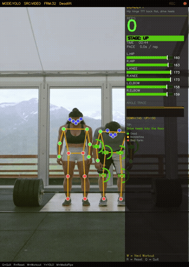
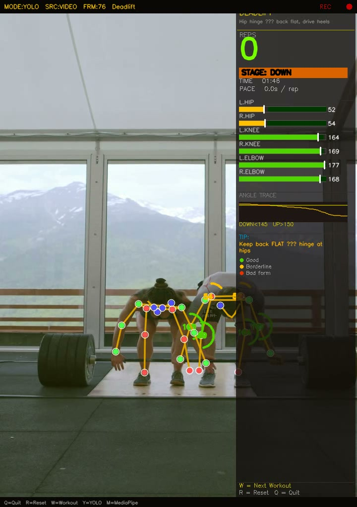

# Pose Estimation Projects — YOLO & MediaPipe

A collection of computer-vision projects exploring human (and animal!) pose estimation, built with **MediaPipe**, **YOLOv8**, and **YOLO26**. Ranges from real-time landmark detection tutorials to a full multi-person fitness-tracking HUD and a webcam-driven body-language classifier.

<p align="center">
  
</p>

<p align="center">
  <em>Real-time pose detection in action: skeleton keypoints tracked and analyzed live on video.</em>
</p>

## Contents

| Project | Framework | What it does |
|---|---|---|
| [YOLO Fitness Tracker](#1-yolo-fitness-tracker) | YOLO + OpenCV | Multi-person rep/set counter with live form, pace, and calorie HUD |
| [MediaPipe Pose Estimation](#2-mediapipe-pose-estimation) | MediaPipe | Joint-angle calculation and a bicep-curl counter from webcam video |
| [Body Language Decoder](#3-body-language-decoder) | MediaPipe + scikit-learn | Classifies body language/pose from webcam landmarks using a trained ML model |
| [YOLOv8 Keypoint Detection](#4-yolov8-keypoint-detection) | YOLOv8 | Custom keypoint/pose training pipeline, demonstrated on quadruped (animal) pose data |

---

## 1. YOLO Fitness Tracker

📁 [`Files_not-important/fitness_tracker.py`](Files_not-important/fitness_tracker.py)

A real-time, multi-person workout HUD built on top of YOLO pose keypoints. Tracks up to two people at once and renders a full analytics overlay per person.

<p align="center">
  
</p>

**Features**
- Automatic rep & set counting for **squat, deadlift, bicep curl, and shoulder press**, driven by joint-angle thresholds
- Per-person side panel: rep count, sets, exercise stage (up/down), form score, calorie estimate, and an angle-history sparkline
- Live joint-angle arcs drawn directly on the skeleton, color-coded green/cyan/red for good/borderline/bad form
- Pace tracking (average seconds per rep) and a live elapsed-time bar
- Hotkeys: `Q` quit · `R` reset · `E` cycle exercise · `S` save snapshot
- Optional MP4 export of the annotated output

**Run it**
```bash
pip install ultralytics opencv-python numpy
python "Files_not-important/fitness_tracker.py"
```
Edit the `CONFIG` block at the top of the script to point `SOURCE` at a webcam (`0`) or a video file, and adjust `EXERCISE`, `MAX_PERSONS`, body weight, etc.

---

## 2. MediaPipe Pose Estimation

📁 [`MediaPipePoseEstimation-main/Media Pipe Pose Tutorial.ipynb`](<MediaPipePoseEstimation-main/Media Pipe Pose Tutorial.ipynb>)

A from-scratch walkthrough of MediaPipe's Pose solution: detecting the 33 body landmarks, computing joint angles via vector math, and using them to build a live bicep-curl rep counter.

<p align="center">
  
</p>

**Notebook sections**
1. Install & import dependencies (`mediapipe`, `opencv-python`)
2. Run pose detection on a webcam feed
3. Identify the landmark indices used for the exercise (shoulder–elbow–wrist)
4. Calculate joint angles with `numpy`/`arctan2`
5. Build a stateful curl counter (up/down stage machine)

A second, exploratory version of this same workflow lives in [`Files_not-important/Pose-detections.ipynb`](<Files_not-important/Pose-detections.ipynb>).

**Run it**
```bash
pip install mediapipe opencv-python numpy
jupyter notebook "MediaPipePoseEstimation-main/Media Pipe Pose Tutorial.ipynb"
```

---

## 3. Body Language Decoder

📁 [`Body-Language-Decoder-main/Body Language Decoder Tutorial.ipynb`](<Body-Language-Decoder-main/Body Language Decoder Tutorial.ipynb>)

Trains a custom classifier on top of MediaPipe's **Holistic** model (pose + face landmarks) to recognize body-language states (e.g. happy / sad / victorious) live from a webcam.

**Pipeline**
1. Capture pose + face landmarks per frame with `mp_holistic.Holistic`
2. Export labeled landmark rows to `coords.csv`
3. Train and compare several scikit-learn pipelines (Logistic Regression, Ridge, Random Forest, Gradient Boosting)
4. Serialize the best model to `body_language.pkl`
5. Run live inference: draw the predicted class + confidence directly on the webcam feed

**Run it**
```bash
pip install mediapipe opencv-python pandas scikit-learn
jupyter notebook "Body-Language-Decoder-main/Body Language Decoder Tutorial.ipynb"
```

---

## 4. YOLOv8 Keypoint Detection

📁 [`pose-detection-keypoints-estimation-yolov8-main/`](pose-detection-keypoints-estimation-yolov8-main)

An end-to-end custom keypoint-training pipeline for YOLOv8 (`ultralytics`), demonstrated here on a **quadruped/animal pose dataset** (39 keypoints — nose, antlers, ears, legs, paws, tail, etc.), going from CVAT annotations to a trained pose model.

**Contents**
- [`CVAT_to_cocoKeypoints.py`](<pose-detection-keypoints-estimation-yolov8-main/CVAT_to_cocoKeypoints.py>) — converts CVAT keypoint annotations to YOLO/COCO format
- [`config.yaml`](<pose-detection-keypoints-estimation-yolov8-main/config.yaml>) — dataset config (39 keypoints, flip indices, class names)
- [`train.py`](<pose-detection-keypoints-estimation-yolov8-main/train.py>) — fine-tunes `yolov8n-pose` on the custom dataset
- [`inference.py`](<pose-detection-keypoints-estimation-yolov8-main/inference.py>) — runs the trained model on a single image and overlays keypoint indices

**Run it**
```bash
pip install -r "pose-detection-keypoints-estimation-yolov8-main/requirements.txt"
python "pose-detection-keypoints-estimation-yolov8-main/train.py"
python "pose-detection-keypoints-estimation-yolov8-main/inference.py"
```
This sub-project ships its own [LICENSE](<pose-detection-keypoints-estimation-yolov8-main/LICENSE>) (AGPL-3.0, inherited from Ultralytics).

---

## Repository structure

```
.
├── Files_not-important/                          # YOLO fitness tracker + exploratory MediaPipe notebook
│   ├── fitness_tracker.py
│   └── Pose-detections.ipynb
├── MediaPipePoseEstimation-main/                  # MediaPipe pose tutorial (curl counter)
│   └── Media Pipe Pose Tutorial.ipynb
├── Body-Language-Decoder-main/                    # MediaPipe Holistic + scikit-learn classifier
│   └── Body Language Decoder Tutorial.ipynb
├── pose-detection-keypoints-estimation-yolov8-main/  # Custom YOLOv8 keypoint training pipeline
│   ├── train.py / inference.py / config.yaml / class.names
│   └── CVAT_to_cocoKeypoints.py
├── assets/                                        # README media (images, gifs, source clips)
│   ├── images/
│   ├── gifs/
│   └── videos/
└── README.md
```

## Tech stack

`Python` · `OpenCV` · `MediaPipe` · `Ultralytics YOLOv8 / YOLO26` · `NumPy` · `pandas` · `scikit-learn` · `Jupyter`

## Notes

- Each sub-project was originally an independent tutorial/repo and may have its own dependency versions — see the **Run it** section above for each.
- Large/raw files (source videos, trained model weights, exported datasets) are excluded from version control via [`.gitignore`](.gitignore) to keep the repository lightweight. Only the small, README-facing images/GIFs in `assets/` are tracked.
